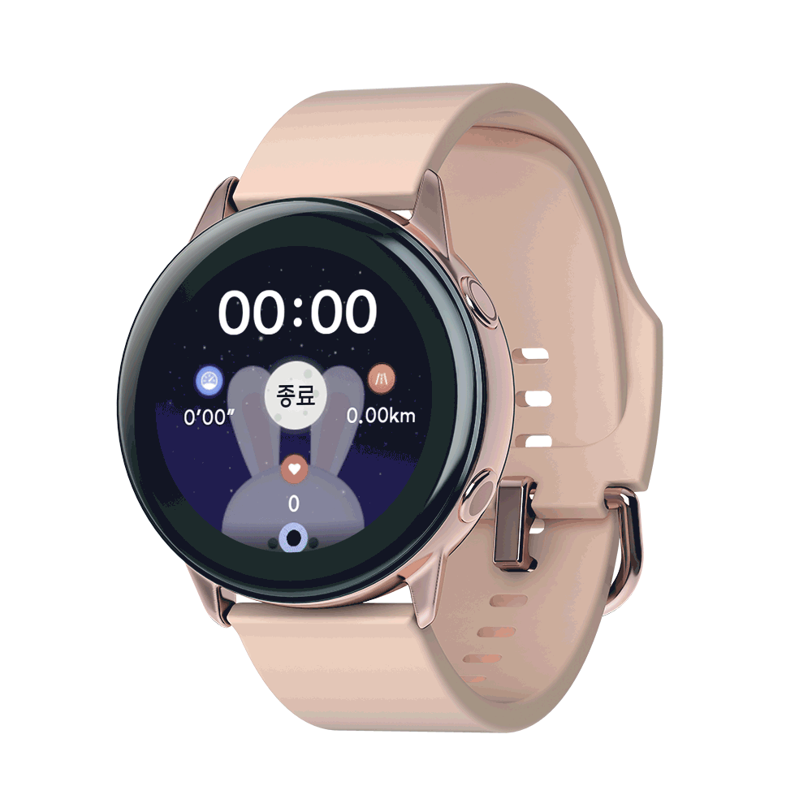
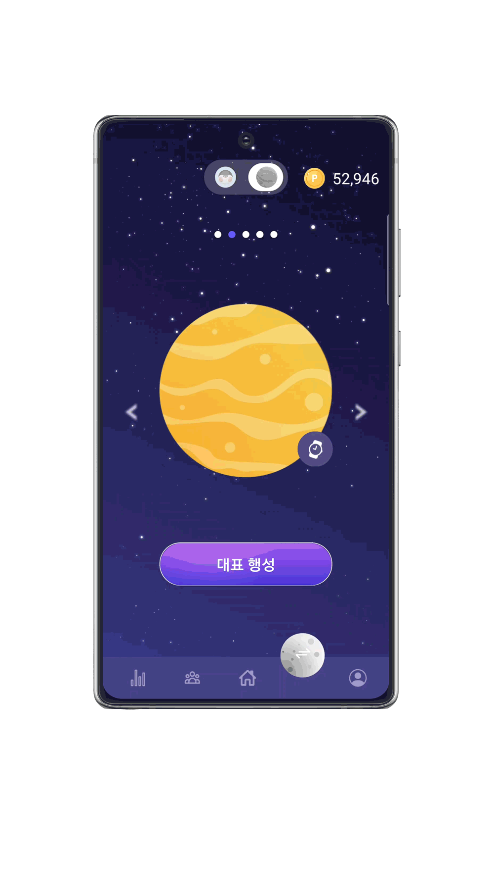

## 🤖 주요 기술 🤖

### [ FRONT ]
- **React**: 서비스 소개 웹 페이지 제작을 위한 라이브러.
- **React-Native**: 갤럭시워치와 안드로이드 모바일 연결에 적합한 모바일 애플리케이션 프레임워크.
- **TypeScript**: 코드의 안정성 및 유지 보수성을 높이는 강력한 타입 시스템을 제공.
- **Styled-Components (Atomic Design)**: React 컴포넌트에 직접 CSS 스타일을 적용하는 효율적인 방법, 코드의 가독성 및 유지 보수성 개선.
- **Recoil**: React 앱의 상태 관리, atom과 selector를 통해 유연하고 효과적인 상태 관리 가능.
  - **CSR (클라이언트 사이드 렌더링) 활용**: 상태 변경(예: 캐릭터, 행성)에 따른 컴포넌트 자동 업데이트로 동적인 UI 및 실시간 상호작용 지원.
  - **SSR (서버 사이드 렌더링) 활용**: 초기 상태를 서버에서 설정하고 HTML을 생성하여 클라이언트로 전송, 빠른 페이지 로드.
- **Axios**: 애플리케이션에서 HTTP 통신을 쉽고 효율적으로 처리.
- **Social Login (NAVER, KAKAO)**: 사용자의 편의성을 높이고 빠른 로그인 경험을 제공하는 네이버 및 카카오 OAuth 인증.
- **react-native-gifted-charts**: 사용자 데이터를 시각적으로 표현하여 분석과 이해를 돕는 강력한 데이터 시각화 도구.
- **Blender**: 독창적인 3D 모델링과 커스텀 디자인을 통한 4종의 캐릭터와 5개의 행성 제작.
- **Gamification**: 사용자 참여 및 동기 부여를 증진시키는 게임화 요소.
  - **CHARACTER (캐릭터)**: 선택 가능한 4종의 캐릭터, 각각 고유의 3단계 진화 과정을 경험.
  - **PLANET (행성)**: 사용자가 5종류의 행성 중에서 선택하여 장착.
  - **Point (포인트)**: 사용자의 활동에 따라 포인트 부여, 캐릭터 및 행성 구매에 사용.
  - **FRIEND MANAGEMENT (친구 관리)**: 온라인 친구와의 연결, 기록 비교 및 대결 기능.
  - **ALARM (알람)**: 정해진 시간에 러닝을 시작하도록 동기 부여, 일관된 운동 습관 형성 지원.
- **FCM(Firebase Cloud Messaging) Push**: 목표 달성 및 러닝에 대한 지속적인 관심과 참여를 유도하는 푸시 알림.
- **Mobile Widget**: 사용자의 모바일 홈 화면에 위젯 추가로 러닝 관련 정보 표시.
- **Location Weather**: 현재 위치 기반 날씨 정보를 제공하여 러닝 조건에 최적화된 환경 확인 및 악천후 대비 가능.

### [ BACK ]

### [ TEAM ]
- **GitLab**: 프로젝트의 코드와 문서 관리.
- **Jira**: 프로젝트 일정, 이슈 및 작업 관리.
  - **Scrum (Agile)**: 1주 주기의 프로젝트 스프린트와 매일 5분의 스크럼미팅을 통한 통한 긴밀한 팀 협업과 소통.
- **Mattermost**: 팀 내 의사소통 및 파일 공유를 지원하는 협업 도구 활용.

# 소개

## 개요

**_👏 SSAFY 9기 2학기 자율 프로젝트 👏_**  
<aside>
 **갤럭시 워치**를 이용한 러닝 서비스 어플리케이션입니다.

달림은 **나 자신과의 경쟁**에서 시작되었습니다. 러닝을 하며 나 자신과, 그리고 다른 사람과 경쟁을 하면서 성취감도 얻고 러닝에 대한 동기 부여도 얻을 수 있는 서비스입니다.

**워치**를 이용하여 러닝을 하고, 러닝이 끝나면 실시간으로 연동되는 데이터를 **모바일**에서 러닝 기록을 확인할 수 있습니다. 또한 캐릭터, 행성에 대한 **커스터마이징**, 지정된 날짜/시간에 대한 **알림**, 실시간 러닝 **랭킹** 등을 통해 사용자가 꾸준히 러닝을 할 수 있도록 하였습니다.

</aside>

> 2023.10.9 ~ 2023.11.17 (6주)

 
# ⌛ 프로젝트 기간 : 2023. 10. 9 ~ 2023. 11. 17.

# 👥 팀 구성
<table align="center">
  <tr>
    <td align="center"><a href="https://github.com/SeongLI"> <b>이은성  Front-end </b></a></td>
    <td align="center"><a href="https://github.com/Eungae-D"> <b>최규호  Front-end </b></a></td>
    <td align="center"><a href="https://github.com/soyeonnnb"> <b>김소연  Front-end </b></a></td>
    <td align="center"><a href="https://github.com/yeonchaking"> <b>연제경 PM </b></a></td>
    <td align="center"><a href="https://github.com/pum005"> <b>최시환 Back-end </b></a></td>
    <td align="center"><a href="https://github.com/qkrrlgus114"> <b>박기현  Back-end </b></a></td>
</table>
 

# 📌 주요 기능

### 메인 페이지

### 혼자 달리기 & 함께 달리기

|                                                 혼자 달리기                                                  |                                                                      함께 달리기                                                                      |
| :-----------------------------------------------------------------------------------------------------: | :------------------------------------------------------------------------------------------------------------------------------------------------: |
|                                                                              |                                                                                                                     |
| 갤럭시 워치를 통해 혼자 달리기를 할 수 있습니다. | 함께 달릴 러닝메이트를 설정하고, 해당 러닝메이트와 함께 달릴수 있습니다. 러닝메이트와의 거리 차이가 화면에 실시간으로 표시됩니다. |

### 차트 & 달력

|                                                 차트 & 달력                                                  |                                                             
| :-----------------------------------------------------------------------------------------------------: |
|                                                                              |      
| 혼자 또는 함께 달린 기록을 차트를 통해 간편하게 확인 할 수 있습니다.   속도, 심박수 변화 그래프를 확인 할 수 있습니다.|

### 소셜 - 비교하기

|     비교하기           |                                                                                                                                                                                 
| :---------------------------------------: |
|           |                                                                                                                                                                                                                                                       
| 달림 서비스 사용자들과 나의 정보를 비교할 수 있습니다. | 

 

### 캐릭터 & 테마 설정

|                                                                                         캐릭터 설정                                                                                          |                                                                                                                                                                                 테마 설정                                                                                                                                                                               |
| :-----------------------------------------------------------------------------------------------------------------------------------------------------------------------------------: | :--------------------------------------------------------------------------------------------------------------------------------------------------------------------------------------------------------------------------------------------------------------------------------------------------------------------------------------------------------------------------: |
|                                                                |                                                                                                                                                                                                                                                       |
| 함께 달리기 할 캐릭터를 선택할 수 있습니다.   선택 한 캐릭터가 워치와 모바일에 대표 캐릭터로 적용됩니다. | 함께 달리기할 테마를 선택할 수 있습니다..   선택 한 테마가 워치와 모바일에 대표 테마로 적용됩니다. |

 

### 위젯 & 알림

|                                                                                         위젯                                                                                         |                                                                                                                                                                                 알림                                                                                                                                                                              |
| :-----------------------------------------------------------------------------------------------------------------------------------------------------------------------------------: | :--------------------------------------------------------------------------------------------------------------------------------------------------------------------------------------------------------------------------------------------------------------------------------------------------------------------------------------------------------------------------: |
|                                                                |                                                                                                                                                                                                                                                       |
| 내가 운동한 날짜, 그리고 귀여운 달림 캐릭터 들을 위젯으로 사용할 수 있습니다. | 주기적으로 운동할 날짜를 지정하고, 운동 알림을 받을 수 있습니다.  |

 

## 빌드 환경

| FrontEnd                | BackEnd                                      | Database   | Infra                      |
| :---------------------- | :------------------------------------------- | :--------- | :------------------------- |
| Node.js 18.16.1         | Java 11           | MySQL | AWS EC2 (Ubuntu 20.04 LTS) |
| React.js 18.2.0         | Spring Boot 2.7.15                            | MongoDB    | Docker 23.0.6              |
| react-native        | Gradle 8.1.1                                 | Redis      | Nginx 1.18.0               |
| typescript      | Spring Data JPA                                          |    | Jenkins 2.401.2 LTS        |
| react-native styled components      | Spring Security |            |               |
| | lombok                                       |            |       |
| | Oauth 2.0                                         |   |
| | JWT                                          |  |

 

 

## 산출물

[✨ Figma 디자인 명세](https://www.figma.com/files/team/1293740638879285710/%EC%97%AC%EB%8D%9F%ED%8A%B8?fuid=1055051160728593576)

[🌳 요구사항 명세서](https://www.notion.so/soyeonnnb/d28d940e32a648dcb0a8b6ec1c266109)

[📌 노션 API 명세](https://www.notion.so/soyeonnnb/913aeb51ff6245d3b476cea3091e390a)

[🐳 ERD Cloud](https://www.erdcloud.com/d/T899y4ovym8Q6wPCW)

 
